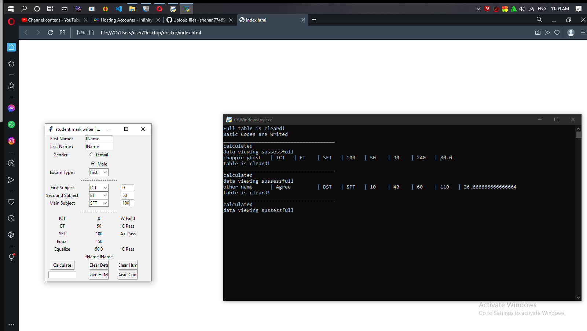
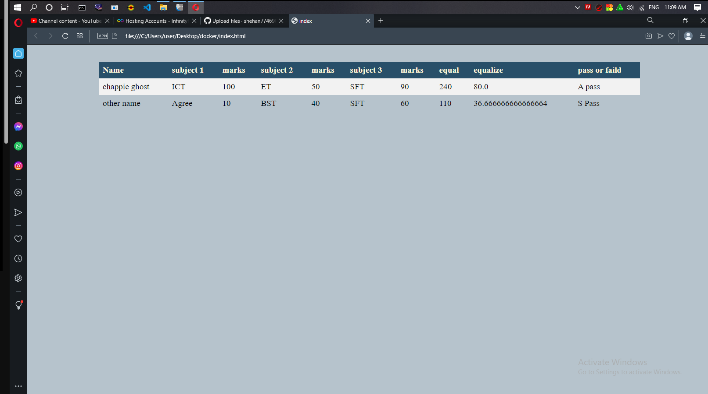

# Python-Student-Data-Viewer-HTML
Created in Python (TK Inter), this small software allows students to search any amount of data in an HTML page.

<li>First download all the files into a single folder.</li> 
<li>After that, if Python is installed, open the main.py file using your IDLE</li>
<li>After that run the code</li>
<h2>How to use the software </h2>
<li>Open the software</li>
<li>Click the Basic Code button to generate the HTML file</li>
<i>Once the creation is done, it will show as "Basic Codes are writed" in the terminal</i>
<li>Enter First Name, Last Name, Gender, Exsam Type, First Subject, Secound Subject, Main Subject</li>
<li>Press the Calculate button to calculate</li>
<li>Finally, by providing the search html, the web page will be searched.</li>

<h2>Button and action</h2>
<li><b>Calculate </b> - <i>Obtaining the sum, average and standard deviation of the given data </i>
<li><b>Clear Data </b> - <i>clearing the data used in the software </i>
<li><b>Clear Html </b> - <i>clearing the entire HTML page </i>
<li><b>Save HTML </b> - <i>searching for data given in the HTML file </i>
<li><b>Basic Code </b> - <i>Entering basic codes before searching data </i>

 
<h2 style="color: #ff0000;">ISSUES</h2>
 <li><i> Given the data, calculate it and search data without basic code, no style can be seen. </i></li>
 <li><i> Double pressing the BASIC CODE button may change the displayed data</li><i>

<h2>Softwera Interface</h2>

 
<h2>Data Sheet</h2>

